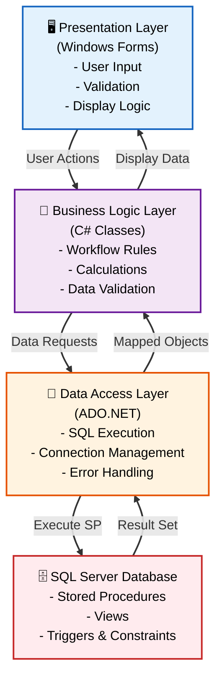
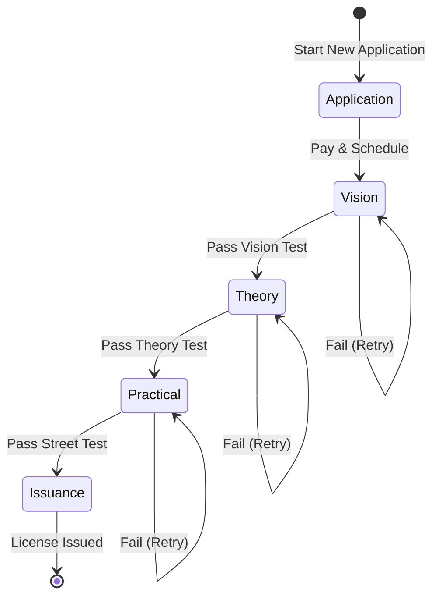
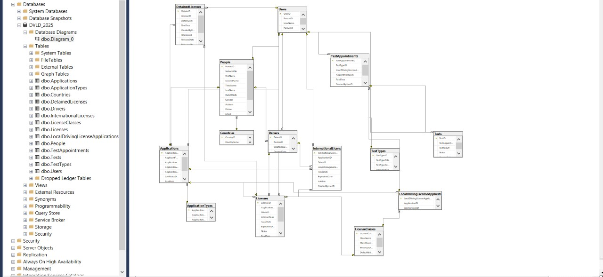
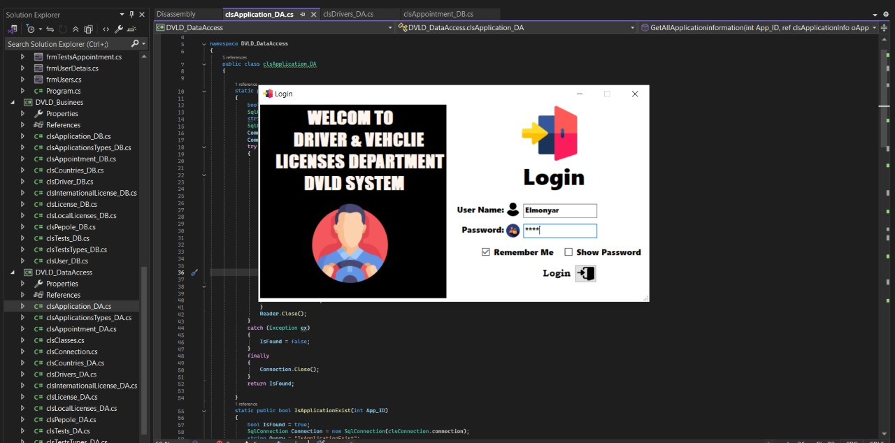
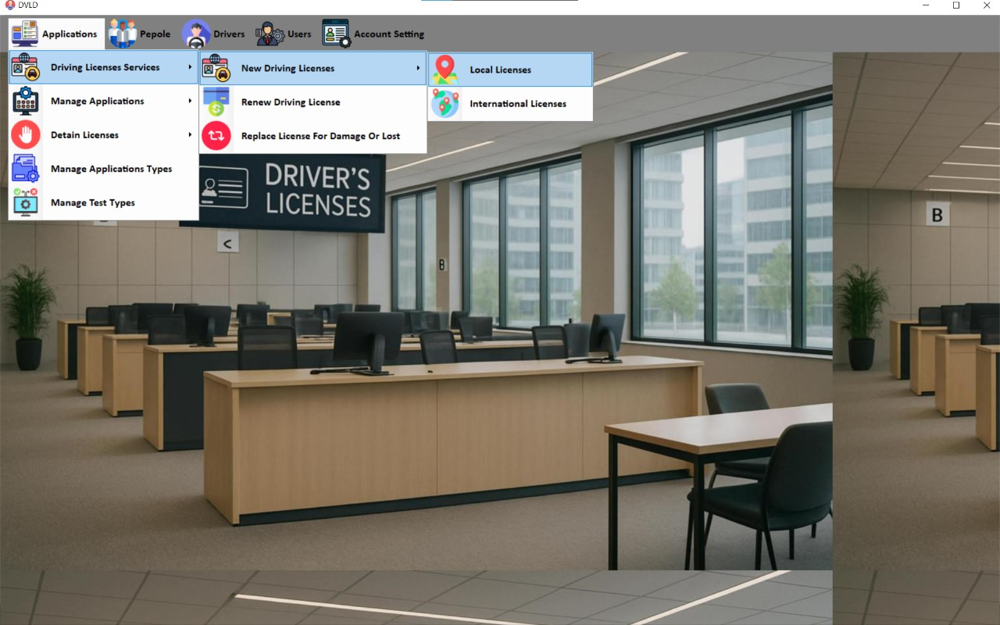
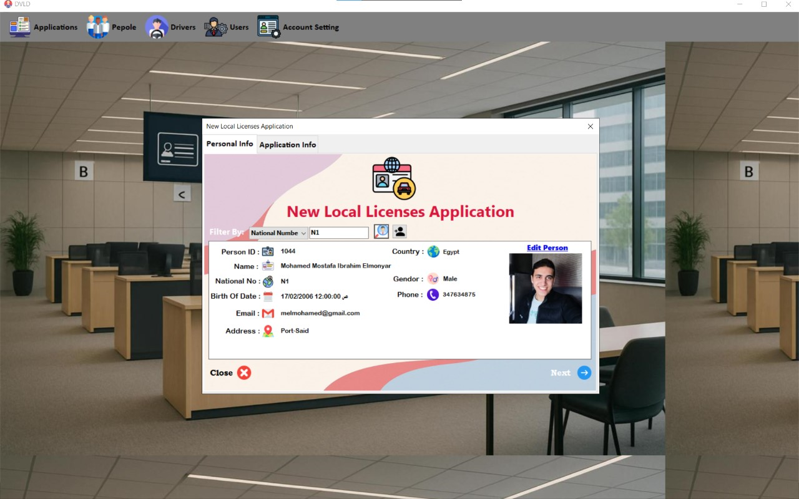

<div align="center">

# 🚗 DVLD - DRIVING LICENSE MANAGEMENT SYSTEM


<h3>🏛️ Enterprise-Grade Government Workflow Automation</h3>
<h4>Built with 3-Tier Architecture & Database-First Design</h4>

> 🎯 **A complete license lifecycle management system**
> 
> 📋 Simulating real-world governmental processes from registration to renewal

[**✨ Features**](#-core-capabilities--business-modules) • [**🏗 Architecture**](#-architecture--design-patterns) • [**🚀 Quick Start**](#-getting-started)

---

</div>

## 📋 Table of Contents

- [🌟 Overview](#-overview)
- [✅ Business Modules](#-core-capabilities--business-modules)
- [🏗 Architecture](#-architecture--design-patterns)
- [🗄️ Database Design](#%EF%B8%8F-database-engineering)
- [💻 Code Highlights](#-code-highlights)
- [🛠 Tech Stack](#-technology-stack)
- [📸 Screenshots](#-application-screenshots)
- [⚡ Getting Started](#-getting-started)
- [👨‍💻 Author](#-author)

<br/>

## 🎥 Project Walkthrough

<div align="center">

  <a href="https://www.linkedin.com/posts/mohamed-elmonyar_csharp-sqlserver-softwaredevelopment-activity-7351874908244598784-1Ye6?utm_source=share&utm_medium=member_desktop&rcm=ACoAAFWkEG8BYfoNH-bD03ZtssRbWcD_4_yo3z4" target="_blank"
     style="
        display: inline-block;
        padding: 14px 28px;
        background: linear-gradient(135deg, #0078D7, #00B4D8);
        color: white;
        font-size: 18px;
        font-weight: 600;
        border-radius: 10px;
        text-decoration: none;
        box-shadow: 0 6px 14px rgba(0,0,0,0.25);
     ">
     ▶ Watch Full System Demo
  </a>

  <p style="margin-top:10px;"><i>Complete walkthrough of the licensing workflow, database architecture, and security features.</i></p>

</div>


---

## 🌟 Overview

<div align="center">

**DVLD (Driving & Vehicle License Department)** is a comprehensive desktop application designed to automate the complete lifecycle of driving license management.

It simulates a **real-world governmental workflow** with strict validation rules and multi-step approval processes.

</div>

<br/>

This system showcases advanced **desktop application development** using Windows Forms, demonstrating expertise in building complex, data-intensive enterprise solutions with robust business logic and database-first design principles.

<br/>

### 💡 The System's Purpose

<table>
<tr>
<td width="33%">

#### 👤 Citizen Services
Complete driver registration, application submission, and test scheduling in one unified platform.

</td>
<td width="33%">

#### 🏛️ Government Operations
Streamlined workflow for license issuance, renewals, replacements, and violations management.

</td>
<td width="33%">

#### 📊 Administrative Control
Full oversight of users, permissions, fees, and system configuration.

</td>
</tr>
</table>

<div align="center">

**Built to handle high-volume transactions with data integrity as the top priority.**

</div>

<br/>

---

## ✅ Core Capabilities & Business Modules

<div align="center">

### Business Process Coverage

</div>

| Module | Core Features |
|:------:|:-------------|
| **👤 Person & Driver Registry** | `National ID Validation` • `Comprehensive Profile Management` • `Driver History Tracking` • `Advanced Search & Filtering` |
| **🪪 License Issuance Workflow** | `7 License Classes` • `Sequential Testing System` • `Vision → Theory → Practical` • `Automated Fee Calculation` |
| **🌍 International Licenses** | `Eligibility Verification` • `Instant Issuance for Valid Holders` • `Expiry Management` • `Document Generation` |
| **🔄 License Lifecycle** | `Renewal Processing` • `Replacement (Lost/Damaged)` • `Detain & Release System` • `Status Tracking` |

<br/>

---

## 🚀 Key Engineering Highlights

<br/>

### 🏗 **Strict 3-Tier Architecture**

The system is engineered with clear separation of concerns, ensuring maintainability and testability:



<br/>

### 📋 **Complex Business Workflow Engine**

Unlike simple CRUD applications, DVLD enforces strict state machines and sequential processes:

<div align="center">

#### 🎓 License Issuance Process Flow



</div>

**Key Rules Enforced:**
- Cannot skip test sequence (Vision → Theory → Practical)
- Must pass previous test before scheduling next
- Each test has retry limits and cooldown periods
- Automatic fee calculation based on application type

<br/>

### 🗄️ **Database-First Design Philosophy**

Unlike typical ORM-heavy applications, DVLD pushes business logic to the database layer:

<table>
<tr>
<td width="50%">

**🔒 Data Integrity at Source**
- All CRUD operations via Stored Procedures
- Complex business rules enforced by Triggers
- Foreign Key Constraints prevent orphaned records
- Computed Columns for automatic calculations

</td>
<td width="50%">

**⚡ Performance Optimization**
- Indexed Views for complex reports
- Query optimization by SQL Server
- Minimal network overhead (single SP call)
- Transaction management at DB level

</td>
</tr>
</table>

<br/>

---

## 🏗 Architecture & Design Patterns

### **📂 Project Structure (3-Tier Separation)**

```
DVLD-System/
│
├── 📂 DVLD.PresentationLayer/          # 🖥️ Windows Forms UI
│   ├── Forms/
│   │   ├── People/                     # Person Management
│   │   │   ├── frmListPeople.cs
│   │   │   ├── frmAddEditPerson.cs
│   │   │   └── frmPersonDetails.cs
│   │   ├── Drivers/                    # Driver Management
│   │   ├── Applications/               # Application Workflow
│   │   │   ├── LocalLicense/
│   │   │   ├── InternationalLicense/
│   │   │   └── RenewLicense/
│   │   ├── Tests/                      # Test Appointments
│   │   │   ├── frmTestAppointments.cs
│   │   │   └── frmTakeTest.cs
│   │   ├── Licenses/                   # License Operations
│   │   │   ├── frmIssueDriverLicense.cs
│   │   │   ├── frmRenewLicense.cs
│   │   │   ├── frmReplaceLicense.cs
│   │   │   └── frmDetainRelease.cs
│   │   ├── Users/                      # User Management
│   │   │   ├── frmListUsers.cs
│   │   │   └── frmAddEditUser.cs
│   │   └── Login/
│   │       └── frmLogin.cs
│   │
│   ├── CustomControls/                 # Reusable Components
│   │   ├── ctrlPersonCard.cs
│   │   ├── ctrlDriverLicenses.cs
│   │   └── ctrlApplicationInfo.cs
│   │
│   └── Properties/                     # Assembly Info
│
├── 📂 DVLD.BusinessLayer/              # 💼 Business Logic
│   ├── clsPerson.cs
│   ├── clsDriver.cs
│   ├── clsApplication.cs
│   ├── clsLocalDrivingLicenseApplication.cs
│   ├── clsInternationalLicense.cs
│   ├── clsTest.cs
│   ├── clsTestAppointment.cs
│   ├── clsLicense.cs
│   ├── clsDetainedLicense.cs
│   └── clsUser.cs
│
├── 📂 DVLD.DataAccessLayer/            # 🔧 Data Access
│   ├── clsPersonData.cs
│   ├── clsDriverData.cs
│   ├── clsApplicationData.cs
│   ├── clsLocalDrivingLicenseApplicationData.cs
│   ├── clsInternationalLicenseData.cs
│   ├── clsTestData.cs
│   ├── clsTestAppointmentData.cs
│   ├── clsLicenseData.cs
│   ├── clsDetainedLicenseData.cs
│   ├── clsUserData.cs
│   └── clsDataAccessSettings.cs        # Connection String

```

---

## 🗄️ Database Engineering

<div align="center">

### Entity Relationship Diagram


<br/>

</div>

### **Core Database Entities**

<table>
<tr>
<td width="33%">

**👥 Core Entities**
- People
- Drivers
- Users
- Countries

</td>
<td width="33%">

**📋 Application System**
- Applications
- ApplicationTypes
- LocalDrivingLicenseApplications
- InternationalLicenses

</td>
<td width="33%">

**🪪 License Management**
- Licenses
- LicenseClasses
- DetainedLicenses
- Drivers (Junction)

</td>
</tr>
<tr>
<td colspan="3" align="center">

**🧪 Testing System:** Tests • TestAppointments • TestTypes

</td>
</tr>
</table>

### **🎯 Key Database Features**

```sql
-- Example: Stored Procedure for Adding Application
CREATE PROCEDURE SP_AddNewApplication
    @ApplicantPersonID INT,
    @ApplicationDate DATETIME,
    @ApplicationTypeID INT,
    @ApplicationStatus TINYINT,
    @LastStatusDate DATETIME,
    @PaidFees SMALLMONEY,
    @CreatedByUserID INT,
    @NewApplicationID INT OUTPUT
AS
BEGIN
    SET NOCOUNT ON;
    
    BEGIN TRANSACTION;
    
    INSERT INTO Applications (
        ApplicantPersonID, ApplicationDate, ApplicationTypeID,
        ApplicationStatus, LastStatusDate, PaidFees, CreatedByUserID
    )
    VALUES (
        @ApplicantPersonID, @ApplicationDate, @ApplicationTypeID,
        @ApplicationStatus, @LastStatusDate, @PaidFees, @CreatedByUserID
    );
    
    SET @NewApplicationID = SCOPE_IDENTITY();
    
    COMMIT TRANSACTION;
END
```

---

## 💻 Code Highlights

### 🏛️ **3-Tier Implementation Example**

Let's see how a single operation (Issuing License) flows through all 3 layers:

#### **1️⃣ Presentation Layer (UI)**

```csharp
// Located in: frmIssueDriverLicense.cs
private void btnIssueLicense_Click(object sender, EventArgs e)
{
    // UI Layer: Collect input and validate
    if (string.IsNullOrWhiteSpace(txtNotes.Text))
    {
        MessageBox.Show("Please enter any notes.", "Validation", 
            MessageBoxButtons.OK, MessageBoxIcon.Warning);
        return;
    }

    // Call Business Layer
    int NewLicenseID = _LocalDrivingLicenseApplication.IssueLicenseForTheFirstTime(
        txtNotes.Text.Trim(), 
        clsGlobal.CurrentUser.UserID
    );

    if (NewLicenseID != -1)
    {
        MessageBox.Show($"License Issued Successfully with ID = {NewLicenseID}", 
            "Success", MessageBoxButtons.OK, MessageBoxIcon.Information);
        
        this.Close();
    }
    else
    {
        MessageBox.Show("License Issuance Failed!", 
            "Error", MessageBoxButtons.OK, MessageBoxIcon.Error);
    }
}
```

#### **2️⃣ Business Logic Layer (BLL)**

```csharp
// Located in: clsLocalDrivingLicenseApplication.cs
public int IssueLicenseForTheFirstTime(string Notes, int CreatedByUserID)
{
    // Business Rule: Verify all tests are passed
    if (!DoesPassAllTests())
    {
        return -1;
    }

    // Business Rule: Check if already has active license
    if (DoesAttainPreviousLicense())
    {
        return -1;
    }

    // Create license object
    clsLicense License = new clsLicense();
    
    License.ApplicationID = this.ApplicationID;
    License.DriverID = this.ApplicantPersonID;
    License.LicenseClass = this.LicenseClassID;
    License.IssueDate = DateTime.Now;
    License.ExpirationDate = DateTime.Now.AddYears(
        clsLicenseClass.Find(this.LicenseClassID).DefaultValidityLength
    );
    License.Notes = Notes;
    License.PaidFees = clsLicenseClass.Find(this.LicenseClassID).ClassFees;
    License.IsActive = true;
    License.IssueReason = clsLicense.enIssueReason.FirstTime;
    License.CreatedByUserID = CreatedByUserID;

    // Save to database via DAL
    if (License.Save())
    {
        // Update application status to complete
        this.CompleteApplication();
        return License.LicenseID;
    }

    return -1;
}
```

#### **3️⃣ Data Access Layer (DAL)**

```csharp
// Located in: clsLicenseData.cs
public static int AddNewLicense(
    int ApplicationID, int DriverID, int LicenseClass,
    DateTime IssueDate, DateTime ExpirationDate, string Notes,
    decimal PaidFees, bool IsActive, byte IssueReason, int CreatedByUserID)
{
    int LicenseID = -1;

    // ADO.NET Connection
    SqlConnection connection = new SqlConnection(clsDataAccessSettings.ConnectionString);

    // Execute Stored Procedure
    string query = @"EXEC SP_AddNewLicense 
                     @ApplicationID, @DriverID, @LicenseClass,
                     @IssueDate, @ExpirationDate, @Notes,
                     @PaidFees, @IsActive, @IssueReason, @CreatedByUserID";

    SqlCommand command = new SqlCommand(query, connection);

    // Parameters
    command.Parameters.AddWithValue("@ApplicationID", ApplicationID);
    command.Parameters.AddWithValue("@DriverID", DriverID);
    command.Parameters.AddWithValue("@LicenseClass", LicenseClass);
    command.Parameters.AddWithValue("@IssueDate", IssueDate);
    command.Parameters.AddWithValue("@ExpirationDate", ExpirationDate);
    command.Parameters.AddWithValue("@Notes", Notes);
    command.Parameters.AddWithValue("@PaidFees", PaidFees);
    command.Parameters.AddWithValue("@IsActive", IsActive);
    command.Parameters.AddWithValue("@IssueReason", IssueReason);
    command.Parameters.AddWithValue("@CreatedByUserID", CreatedByUserID);

    try
    {
        connection.Open();
        object result = command.ExecuteScalar();

        if (result != null && int.TryParse(result.ToString(), out int insertedID))
        {
            LicenseID = insertedID;
        }
    }
    catch (Exception ex)
    {
        // Log error (Serilog/File)
        clsEventLogger.LogError("AddNewLicense", ex.Message);
    }
    finally
    {
        connection.Close();
    }

    return LicenseID;
}
```

---


```

---

### 🎨 **Custom Reusable Control**

```csharp
// Located in: ctrlPersonCard.cs
public partial class ctrlPersonCard : UserControl
{
    private clsPerson _Person;
    
    public int PersonID => _Person?.PersonID ?? -1;

    public void LoadPersonInfo(int PersonID)
    {
        _Person = clsPerson.Find(PersonID);

        if (_Person == null)
        {
            MessageBox.Show("Person not found!", "Error", 
                MessageBoxButtons.OK, MessageBoxIcon.Error);
            return;
        }

        // Populate UI controls
        lblPersonID.Text = _Person.PersonID.ToString();
        lblFullName.Text = _Person.FullName;
        lblNationalNo.Text = _Person.NationalNo;
        lblGender.Text = (_Person.Gender == 0) ? "Male" : "Female";
        lblEmail.Text = _Person.Email;
        lblPhone.Text = _Person.Phone;
        lblDateOfBirth.Text = _Person.DateOfBirth.ToShortDateString();
        lblCountry.Text = _Person.CountryInfo.CountryName;
        lblAddress.Text = _Person.Address;

        // Load Image
        if (_Person.ImagePath != "")
            pbPersonImage.ImageLocation = _Person.ImagePath;
        else
            pbPersonImage.Image = (_Person.Gender == 0) ? 
                Resources.Male_512 : Resources.Female_512;
    }
}
```

---

## 🛠 Technology Stack

<div align="center">

### Core Technologies

**Language:** C# 7.0+ (Object-Oriented Programming)  
**Framework:** .NET Framework 4.8  
**UI:** Windows Forms (WinForms)  
**Database:** Microsoft SQL Server 2019  
**Data Access:** ADO.NET (SqlConnection, SqlCommand, SqlDataReader)

</div>

### **📚 Design Patterns Applied**

<table>
<tr>
<td width="50%">

**Structural Patterns**
- **3-Tier Architecture:** Clear separation of UI, Business, Data
- **Singleton Pattern:** Global user session management
- **Factory Pattern:** Dynamic form creation

</td>
<td width="50%">

**Behavioral Patterns**
- **State Machine:** License application workflow
- **Observer Pattern:** Form refresh on data change
- **Template Method:** Base form inheritance

</td>
</tr>
</table>

---

## 📸 Application Screenshots

<div align="center">


<br/>

<br/>

<br/>

</div>

---

## ⚡ Getting Started

### 📋 Prerequisites

```
✅ Windows 10/11 (64-bit)
✅ .NET Framework 4.8 Runtime
✅ SQL Server 2019 (or SQL Server Express)
✅ SQL Server Management Studio (SSMS)
✅ Visual Studio 2022 (for development)
```

### 🚀 Installation Steps

#### **1️⃣ Clone the Repository**

```bash
git clone https://github.com/YourUsername/DVLD-System.git
cd DVLD-System
```

#### **2️⃣ Database Setup**

```sql
-- Open SQL Server Management Studio (SSMS)
-- Connect to your SQL Server instance
-- Execute the following scripts in order:

1. Open and execute: SQL/DVLD_Schema.sql
2. Open and execute: SQL/StoredProcedures/SP_All.sql
3. Open and execute: SQL/Views/Views_All.sql
4. Open and execute: SQL/SeedData.sql (Optional: Sample data)
```

#### **3️⃣ Configure Connection String**

```csharp
// Located in: DVLD.DataAccessLayer/clsDataAccessSettings.cs
public static class clsDataAccessSettings
{
    // Update this connection string to match your SQL Server instance
    public static string ConnectionString = 
        @"Server=YOUR_SERVER_NAME;
          Database=DVLD;
          User Id=YOUR_USERNAME;
          Password=YOUR_PASSWORD;";
    
    // OR use Windows Authentication:
    // "Server=.;Database=DVLD;Integrated Security=true;"
}
```

#### **4️⃣ Build and Run**

```bash
# Open the solution in Visual Studio
start DVLD.sln

# Or build from command line
msbuild DVLD.sln /p:Configuration=Release

# Run the executable
cd DVLD.PresentationLayer/bin/Release
DVLD.exe
```

#### **5️⃣ Login Credentials**

```
👤 Username: admin
🔒 Password: 1234

Note: Change this immediately after first login!
```

---

## 📊 System Capabilities Summary

<div align="center">

| Metric | Count | Description |
|--------|-------|-------------|
| **📄 Forms** | 20+ | Comprehensive UI coverage |
| **🔧 Business Classes** | 25+ | Core domain entities |
| **🗄️ Stored Procedures** | 50+ | Database operations |
| **🎨 Custom Controls** | 5+ | Reusable components |


</div>

---

## 🎯 Learning Outcomes

This project demonstrates mastery of:

✅ **Desktop Application Development** (Windows Forms)  
✅ **3-Tier Architecture** implementation  
✅ **Database-First Design** with Stored Procedures  
✅ **ADO.NET** for efficient data access  
✅ **Complex Business Logic** handling  
✅ **State Machine** implementation  
✅ **UI/UX Design** for enterprise applications  
✅ **Security** considerations (Authentication, Authorization)

<div align="center">

## 👨‍💻 Author

### **Mohamed Elmonier**

*Backend Developer | .NET Desktop & Web Specialist*

[](https://github.com/MohamedElmonyar)
[]([https://linkedin.com/in/your-profile](https://www.linkedin.com/in/mohamed-elmonyar/))

---

### 🚗 **Built with .NET Framework & SQL Server**

*A showcase of enterprise desktop application development.*

*Demonstrating expertise in 3-tier architecture, complex workflows, and database engineering.*

---

### 📬 Want to See More?

This is one of several portfolio projects demonstrating different aspects of .NET development:

- **ERP System:** Multi-Tenant SaaS with Clean Architecture (.NET 10 + PostgreSQL)
- **OSV Platform:** Real-Time AI Orchestration (ASP.NET Core + SignalR)
- **DVLD System:** Enterprise Desktop Application (WinForms + SQL Server) ← *You are here*

📧 **Contact:** mohamed.elmonyar@example.com

</div>

---

<div align="center">

**⭐ If you find this project useful for learning, please star the repository!**

</div>
